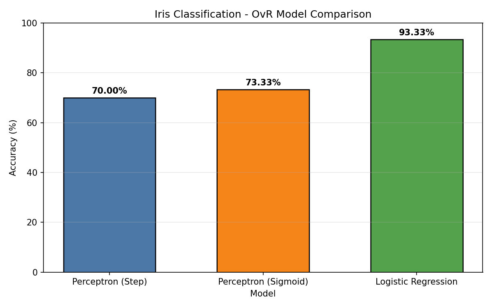

# Results

This document summarizes the experimental results of the Iris Species Classification project, comparing three classification strategies — **Perceptron (Step Function)**, **Perceptron (Sigmoid Function)**, and **Logistic Regression** — each extended to multi-class classification using a **One-vs-Rest (OvR)** strategy.

## Experiment Setup

- **Dataset:** Iris dataset (150 samples, 3 classes, 4 features)
- **Split:** 80% training (120 samples) / 20% testing (30 samples), stratified
- **Preprocessing:** Features standardized using `StandardScaler`
- **Training:** 1000 epochs per binary classifier, One-vs-Rest decomposition (3 classifiers per model)

## Accuracy Comparison

| Model                  | Accuracy   |
|-------------------------|-----------|
| Perceptron (Step)        | ~70%   |
| Perceptron (Sigmoid)     | ~73%   |
| Logistic Regression      | **~93%** |



*Bar chart comparing the test-set accuracy of all three models.*

## Analysis

**Logistic Regression** clearly outperforms both perceptron-based approaches. It is trained using full **batch gradient descent** — every weight update considers the error across the *entire* training set — which produces a smoother, more stable convergence toward an optimal decision boundary.

The **Step Function Perceptron** and **Sigmoid Perceptron** both update their weights using a *single randomly chosen sample* per iteration. This makes their learning noisier and more sensitive to the order in which samples are encountered, which limits how precisely they can separate the three classes — particularly **Versicolor** and **Virginica**, which are known to overlap more than Setosa does with the other two.

> **Note on reproducibility:** The Step and Sigmoid Perceptrons rely on random sample selection during training, so their accuracy can vary slightly between runs (typically in the high-60s to mid-70s range). Logistic Regression's result is stable across runs since it uses full-batch gradient descent rather than random sampling. Setting a fixed seed (e.g. `np.random.seed(42)`) before training is recommended for fully reproducible results.

## Sample Console Output

```
 Iris Flowers Data
================================================================================
   sepal length (cm)  sepal width (cm)  petal length (cm)  petal width (cm)
0                5.1               3.5                1.4               0.2
1                4.9               3.0                1.4               0.2
2                4.7               3.2                1.3               0.2
3                4.6               3.1                1.5               0.2
4                5.0               3.6                1.4               0.2

 Classes (target values): 0 = Setosa, 1 = Versicolor, 2 = Virginica

 RESULTS
============================================================
Perceptron (Step Function) Accuracy: 0.7000
Perceptron (Sigmoid) Accuracy: 0.7333
Logistic Regression Accuracy: 0.9333

 Model performance Comparison
==================================================
| Model                |   Accuracy |
|-----------------------|-----------|
| Perceptron (Step)     |     70.00 |
| Perceptron (Sigmoid)  |     73.33 |
| Logistic Regression   |     93.33 |
```

## Prediction on a New, Unseen Sample

A new flower sample with measurements `[5.1, 3.5, 1.4, 0.2]` cm (sepal length, sepal width, petal length, petal width) was passed through all three trained models after scaling with the same `StandardScaler` fitted on the training data:

| Model                 | Predicted Species |
|-------------------------|-------------------|
| Perceptron (Step)        | Setosa           |
| Perceptron (Sigmoid)     | Setosa           |
| Logistic Regression      | Setosa           |

All three models correctly predicted **Setosa**, consistent with the known characteristics of the species (notably its small petal size).

## Conclusion

The results confirm the expected trend: moving from a simple hard-threshold perceptron → a smoother sigmoid-based perceptron → a fully gradient-optimized logistic regression model improves classification accuracy. **Logistic Regression, trained with full-batch gradient descent, gives the most consistent and accurate results on this dataset.**
